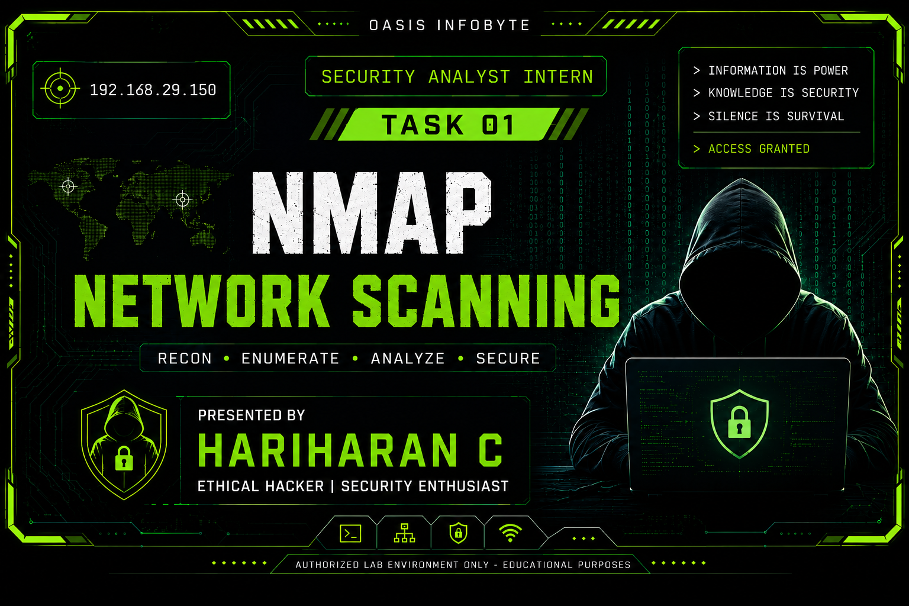

# 🔍 Task 1 - Basic Network Scanning with Nmap


---

<p align="center">
  
</p>

## 📖 Overview

This project was completed as part of the **Oasis Infobyte Security Analyst Internship**.

The objective of this task is to perform basic network reconnaissance using **Nmap** to identify:

- Live hosts
- Open TCP ports
- Running services
- Service versions
- Operating System details

The assessment was performed in a controlled lab environment using machines owned by me.

---

## What is Nmap?
**Nmap (Network Mapper)** is a free, open-source tool used by security professionals to discover devices on a network and find open ports and security vulnerabilities. It acts like a digital radar that scans a network to see what devices are active, what software they are running, and how well they are protected.

## Why Nmap is Used?
Network administrators, security engineers, and ethical hackers use Nmap for several core tasks:
- Network Discovery: Automatically maps out all devices (like computers, servers, routers, and smart devices) connected to a specific network.

- Port Scanning: Checks which "doors" (ports) on a computer are open, which helps identify active services like web servers (Port 80/443) or file sharing.

- Operating System Detection: Figures out exactly what operating system (e.g., Windows 11, Ubuntu Linux, macOS) a target device is running.

- Vulnerability Assessment: Finds outdated software or misconfigured settings that hackers could exploit.

## Ethical Guidelines for Using Nmap
Because Nmap can gather sensitive details about a network, it can easily be misused. Scanning a network without proper permission is often considered illegal or a violation of service terms.
Follow these strict ethical rules when using Nmap:

* Get Written Permission First: Never scan a network, website, or IP address that you do not own unless you have explicit, written authorization from the owner.
* Stick to Your Target Scope: Only scan the exact IP addresses, ranges, or domains you were allowed to test. Do not look at neighboring networks. 
* Minimize Network Disruption: Heavy or aggressive scans can slow down networks, crash older devices, or trigger security alarms. Use gentle scanning speeds.  
* Protect the Data You Find: The information gathered by Nmap (like open ports and software versions) is a roadmap for hackers. Keep your scan logs secure. 
* Use Legal Practice Environments: If you want to learn how to use Nmap safely, practice on your own home router, set up virtual machines (like VirtualBox), or use official, legal training sites like [Hack The Box](https://www.hackthebox.com/) or [TryHackMe](https://tryhackme.com/).


## 🎯 Objectives

- Install and verify Nmap
- Perform a basic port scan
- Perform service version detection
- Perform operating system detection
- Analyze discovered services
- Document potential security risks
- Produce a professional scan report

---

## 🖥️ Lab Environment

| Machine | Operating System | Purpose |
|----------|-----------------|----------|
| Kali Linux | Kali Linux 2026 | Attacker |
| Metasploitable2 | Ubuntu Linux | Target |
| VirtualBox | Virtualization | Lab Environment |

---

## 🛠️ Tools Used

- Kali Linux
- Nmap
- VirtualBox
- Linux Terminal

---

## 📂 Project Structure

```text
CyberSecurity-Task1-BasicNetworkScanningwithNmap/
│
├── README.md
├── commands.md
│
├── report/
│   ├── nmap_scan_results.txt
│
└── screenshots/
│   ├── Metasploitabl2VM-IP.png
│   ├── Nmap-Basic-Scan.png
│   ├── Nmap-Installation.png
│   ├── OS-Detection.png
│   ├── Ping.png
│   ├── Port-Detection.png
│   ├── Service-Version-Detection.png
│   ├── Stealth.png
│
│
│
```

---

## 📥 Installing Nmap

Kali Linux comes with Nmap pre-installed.

To verify the installation:

```bash
nmap --version
```

Ubuntu

```bash
sudo apt update
sudo apt install nmap -y
```

Windows

Download from

https://nmap.org/download.html

---

## 🚀 Commands Executed

### Basic Scan

```bash
nmap <target-ip>
```

Purpose

Discover open TCP ports.

---

### Service Version Detection

```bash
nmap -sV <target-ip>
```

Purpose

Identify versions of running services.

---

### Operating System Detection

```bash
sudo nmap -O <target-ip>
```

Purpose

Identify the target operating system.

---

### Aggressive Scan

```bash
sudo nmap -A <target-ip>
```

Purpose

Perform version detection, OS detection, default NSE scripts, and traceroute.

---

## 📊 Scan Summary

| Scan | Status |
|-------|--------|
| Basic Scan | ✅ |
| Service Version Scan | ✅ |
| OS Detection | ✅ |
| Aggressive Scan | ✅ |

---

## 🔐 Security Analysis

The scan identified multiple running services on the target machine.

Each discovered service was analyzed to understand:

- Purpose
- Potential attack surface
- Possible security risks
- Recommendations

Detailed analysis is available inside

```text
report/nmap_scan_results.txt
```

---

## 📸 Screenshots

Example

- Nmap Installation
- Basic Scan
- Service Version Scan
- OS Detection
- Aggressive Scan

---

## 📚 Learning Outcomes

During this task I learned:

- Network reconnaissance
- TCP port scanning
- Service enumeration
- OS fingerprinting
- Security analysis
- Ethical use of Nmap

---

## ⚖️ Ethical Considerations

All scans performed in this project were conducted only against machines owned by me or intentionally vulnerable virtual machines within a private laboratory environment.

No unauthorized or production systems were scanned.

---

## 📖 References

- https://nmap.org/
- https://nmap.org/book/man.html
- https://owasp.org/

---

## 👨‍💻 Author

**Hariharan C**

Security Analyst Intern

Oasis Infobyte

GitHub: https://github.com/hariharan005/