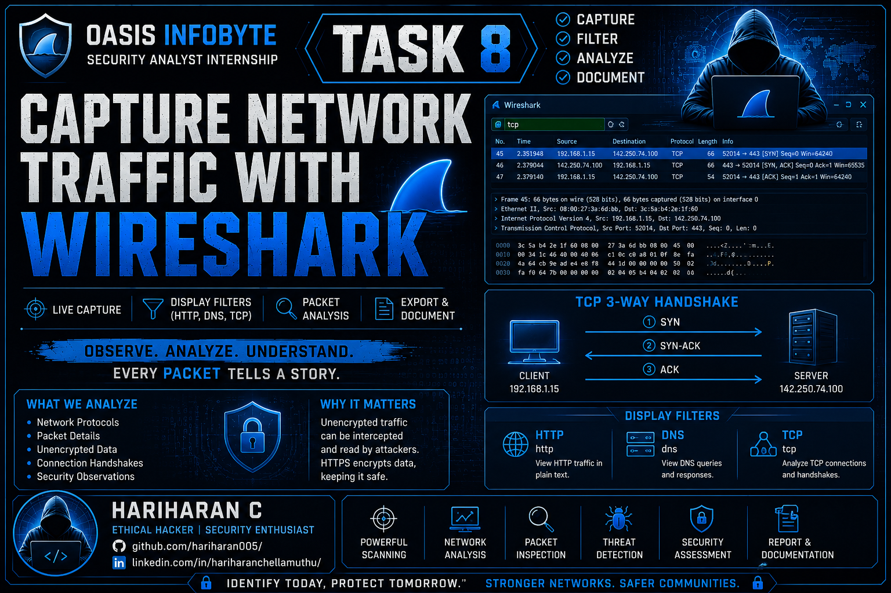

# 🌐 Task 8 – Capture Network Traffic with Wireshark


---

<p align="center">
  
</p>

## 📌 Overview

This project demonstrates how to capture and analyze live network traffic using **Wireshark**. The objective is to inspect different network protocols, understand how devices communicate, identify unencrypted traffic, and analyze the TCP three-way handshake.

All traffic was captured from a **controlled lab environment** using my own Kali Linux system connected to a local network.

---

## 🎯 Objectives

- Install and configure Wireshark
- Capture live network traffic
- Analyze HTTP, DNS, and TCP packets
- Study the TCP 3-way handshake
- Identify unencrypted HTTP communication
- Understand why HTTPS is more secure than HTTP
- Export packet captures for further analysis

---

# 🛠 Tools Used

- Kali Linux
- Wireshark
- Firefox Browser
- curl
- ping
- nslookup

---

# 📂 Project Structure

```
CyberSecurity-Task8-CaptureNetworkTrafficWithWireshark/
│
├── README.md
├── commands.md
├── captures/
│   ├── ICMP.pcap
│   ├── wireshark_capture.pcap
│   ├── wireshark_capture1.pcap
│
├── reports/
│   ├── packets_analysis.md
│
├── screenshots/
│   ├── Wireshark_Installation.png
│   ├── Wireshark_Version.png
│   ├── IP_Check.png
│   ├── Wireshark_interfaceselection_Wlan0.png
│   ├── Live_capturing_Wlan0.png
│   ├── HTTP_Filter.png
│   ├── DNS_Filter.png
│   ├── TCP_Filter.png
│   ├── SYN_Filter.png
│   ├── SYN_ACK_Filter.png
│   ├── ACK_Filter.png
│   ├── ICMP_Filter.png
│   ├── Ping_Request_ICMP.png
│   ├── UDP_Filter.png
│   ├── IPv6_Filter.png
│   ├── Loopback_Interface.png
│   ├── Loopback_http_filter.png
│   └── Unencrypted_Data.png
│
```

---

# 📸 Screenshots

✔ Installation

✔ Live Capture

✔ HTTP Filter

✔ DNS Filter

✔ TCP Filter

✔ TCP Three-Way Handshake

✔ HTTP GET Request

---

# 📡 Protocols Analyzed

## HTTP

- Captured plaintext HTTP requests
- Observed HTTP GET request
- Examined request headers

---

## DNS

- Captured DNS queries
- Observed DNS responses
- Verified domain name resolution

---

## TCP

- Analyzed TCP communication
- Identified TCP Three-Way Handshake
- Studied connection establishment

---

# 🔍 Unencrypted HTTP Packet Analysis

During packet analysis, an HTTP GET request was identified.

The following information was visible in plaintext:

- HTTP Method
- Requested URL
- Host Header
- User-Agent
- Source IP Address
- Destination IP Address
- Source Port
- Destination Port

Because HTTP does not encrypt data, this information can be intercepted and read by anyone monitoring the network.

---

# 🔒 Why HTTP is Dangerous

HTTP transmits information in plain text.

Potential risks include:

- Password theft
- Session hijacking
- Cookie theft
- Data interception
- Man-in-the-Middle attacks

---

# 🛡 Why HTTPS is Secure

HTTPS encrypts all communication using TLS.

Benefits include:

- Confidentiality
- Authentication
- Data Integrity
- Protection against eavesdropping

Unlike HTTP, packet contents cannot be read directly in Wireshark.

---

# 📚 Glossary

## Packet

A small unit of data transmitted across a network.

---

## Protocol

A set of rules that governs communication between network devices.

Examples:

- HTTP
- HTTPS
- DNS
- TCP

---

## Port

A logical communication endpoint used by applications.

Examples:

- 80 → HTTP
- 443 → HTTPS
- 53 → DNS

---

## Payload

The actual data carried inside a network packet.

---

## TCP Three-Way Handshake

A process used to establish a reliable TCP connection.

1. SYN
2. SYN-ACK
3. ACK

---

# 📖 Learning Outcomes

This project helped me understand:

- Packet capture
- Protocol analysis
- HTTP communication
- DNS resolution
- TCP connection establishment
- Network troubleshooting
- Basic traffic inspection

---

# ⚖ Ethical Notice

This project was performed only in a personal lab environment.

No public or unauthorized networks were monitored.

---

# 👨‍💻 Author

**Hariharan C**

GitHub:
https://github.com/hariharan005

LinkedIn:
https://linkedin.com/in/hariharanchellamuthu
